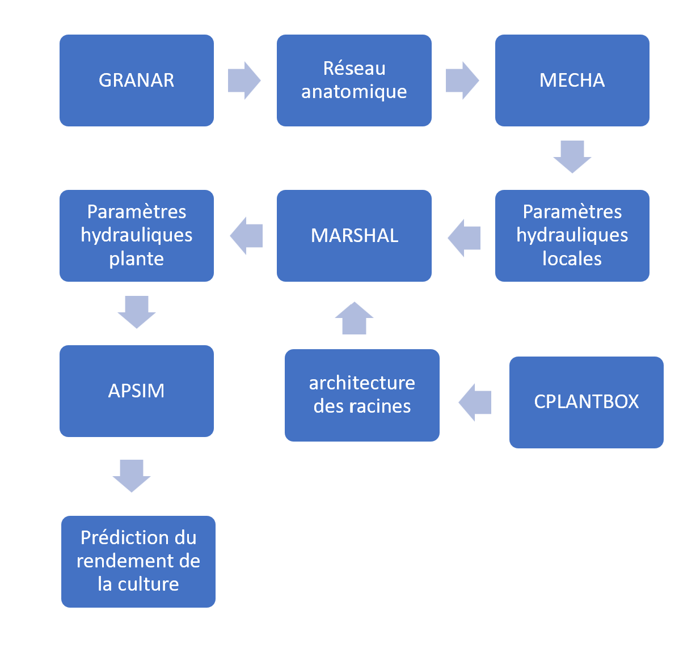
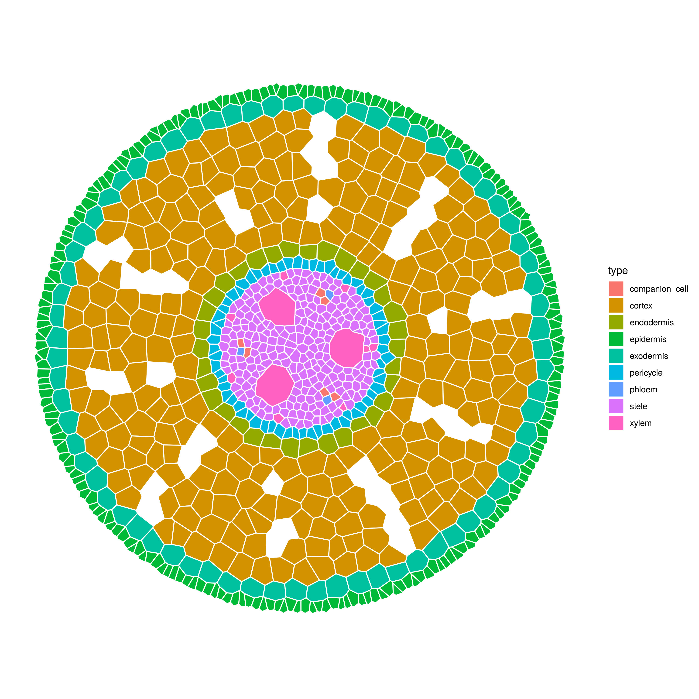
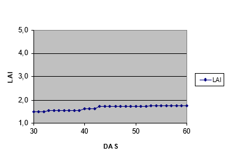
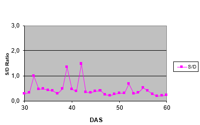
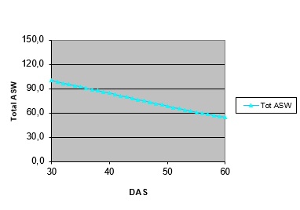

title: "Modélisation des systèmes biologiques"
output: 
  html_document:
    df_print: paged
linespacing: 1.5
  
date: "2023-02-21"
---

```{r setup, include=FALSE}
knitr::opts_chunk$set(echo = TRUE)
knitr::opts_knit$set(root.dir = '~/Modelisation des systèmes biologiques/template_rapport-main') # définir le chemin du derectory 
#library(tidyverse)
library(ggplot2)
library(plyr)
library(readr)
library(data.table)
library(dplyr)
library(Matrix)
```


## Résumé


Dans le cadre du cours LBRAI2219 ‘modélisations des systèmes biologiques', on est amené à réaliser un projet de modélisation qui se focalise sur la simulation des flux d’eau dans le système sol plante. Le projet met l'accent sur :

-Utiliser des modèles existants

-Établir un lien et partager des données entre les différents modèles.

-La mise au point de nouveaux modules pour élargir les capacités des modules utilisés.


## Introduction


### Etat de l’art
La modélisation joue un rôle de premier plan dans différents domaines d'étude. La modélisation nous permet d'aborder un contrôle de la réalité au niveau biologique, économique, chimique, etc. Dans la modélisation, il est important d'imaginer ce qui est caché, et de remplacer les représentations primaires par des variables, paramètres, relations entre variables. Les nouvelles représentations deviennent alors rationnelles et hypothétiques.


Les modèles peuvent être utilisés pour une variété de fin tels que : la compréhension et explication d’un système ou phénomène ; l’optimisation et prise de décision, dans le cadre d’une évaluation de différents scénarios et trouver des solutions optimales pour un problème spécifique ; l’analyse de sensibilité, pour évaluer comment les changements des variables d’entrée vont avoir un impact sur les résultats du système ; prédiction sur le comportement futur du système en utilisant des données et suppositions spécifiques.

### Contexte
Ce projet part de l'image de deux sections transversales de racines, l'une est la racine principale du maïs et l'autre est une racine latérale du maïs. Ces images vont servir pour réaliser une calibration des paramètres anatomiques. Une fois qu'une structure de racine a été créée, l'objectif est de relier les résultats de la modélisation des racines à un modèle de simulation agroécologique qui est utilisé pur prédire les performances d’un système agricole. Suite à ce couplage entre les modèles racine et le modèle de culture, l'interaction entre les rendements et les racines sera analysée de manière à optimiser le système racinaire en cas de déficit hydrique.


## Matériel et méthodes


### Méthode

Dans cette section du rapport je vais décrire les étapes suivies du projet qui sont présentes sur l'image suivante:


<center>
{width=300px}
</center>


La première étape consiste à charger les images 1 et 2, ces images correspondent à deux sections transversales de racines pour le maïs, l'une correspondant à la racine et l'autre correspondant à une racine latérale. Ces images vont servir pour réaliser une calibration des paramètres anatomiques de la racine grâce au modèle GRANAR.


<center>
{width=300px}
</center>


<center>
{width=300px}
</center>


Une fois que la modélisation est faite par Granar, les résultats des racines latérales et principales sont exportés dans un fichier XML pour utilisation dans le modèle suivant.

Deuxièmement les fichiers générés par GRANAR sont utilisés par le modèle MECHA qui va donner comme résultat la conductivité radiale des racines.

Ensuite le modèle Marshal utilise les données hydrauliques générées par MECHA, en plus de ces données il utilise également les données suivantes : 

- Le potentiel hydrique du sol.
- La force initiale de pression qui tire l'eau hors du collet de la plante (Psi_collar).
- L'architecture du système racinaire (RSA).

Les deux premiers points sont des données préexistantes intégrées dans le modèle de base. En ce qui concerne le dernier point, c’est l’outil CRootBox qui va générer l’architecture racinaire pour la plante de maïs.
Marshal nous donne comme résultat la conductivité hydraulique pour le système racinaire, la distribution de l’absorption d’eau de 1 à 3D et d’autres variables à l’échelle du système racinaire.

Finalement la dernière étape est d’utiliser les résultats de Marshal comme la conductivité hydraulique pour le système racinaire ($krs$) et reproduire les résultats du modèle APSIM.

## Problématique et solutions envisagées

Premièrement, le paramètre Krs n’est pas une valeur d’entrée dans le modèle APSIM, c'est pourquoi nous avons besoin d'une première simplification qui consiste à utiliser la valeur de krs pour remplacer une valeur d'entrée dans le modèle APSIM.
Cette première simplification consiste à remplacer la valeur du taux d’extraction d’eau de la culture ($kl$) par le $krs$.

Cette première simplification consiste à remplacer la valeur du taux d’extraction d’eau de la culture ($kl$) par le $krs$.

$kl = f(krs)$

En effet, on peut considérer la conductivité hydraulique racinaire comme une mesure de la capacité du système racinaire à extraire de l’eau du sol. Plus la conductivité hydraulique racinaire est élevée plus le système racinaire est capable de prélever de l’eau du sol rapidement. Cependant, dans cette simplification on néglige d’autres facteurs qui peuvent influencer le taux d’extraction comme :

- Les propriétés du sol :  texture, structure, la composition, la perméabilité et la disponibilité en eau, par exemple les sols argileux ont une plus grande capacité de rétention en raison de la taille plus fine de leurs particules.

Deuxièmement,le modèle APSIM permet de calculer une culture qui se développe en 30 jours, de façon plus précise entre le jour $t = 30$ et le jour $t = 60$. Cependant Marshal calcule le $krs$ pour une architecture racine à un temps $t$.

Afin de résoudre cette problématique j’ai proposé une simplification à réaliser afin de ne pas devoir remplacer les valeurs de Krs du jour $t=30$ au jour $t=60$ :

Utilisation d’une moyenne :  la simplification est d’utiliser une valeur moyenne de conductivité hydraulique racinaire ($krs$), et utiliser cette valeur comme estimation moyenne pour la période de 30 jours. Cette simplification suppose que la valeur de $krs$ reste relativement constante pour la période de 30 jours. Afin de vérifier cette simplification, un calcul de krs est réalisé pour une architecture racinaire d’une période de 60 jours avec un pas de temps de 5 jours.


## Résultats


### Modélisation de l’anatomie racinaire

Dans cette section du rapport, les résultats sur l'anatomie racine créés par le modèle GRANAR sont présentés.

<center>
{width=300px}
</center>


<center>
{width=300px}
</center>

```{r, echo=FALSE}

#data_taproot <- read.csv("~/Modelisation des systèmes biologiques/template_rapport-main/template_rapport-main/inputs/GRANAR/Lateral root/Principal_root_0.03.xml")

#data_lateral_root <- read.csv("~/Modelisation des systèmes biologiques/template_rapport-main/template_rapport-main/inputs/GRANAR/Principal root/Principal_root_0.06.xml")

```


### Modélisation de l’architecture racinaire racinaire

Comme précisé dans la section des méthodes, le modèle CPLANTBOX ou plus précisement CROOTBOX est utilisé pour reproduire une structure racinaire de la plante de maïs. afin d'obtenir la simplification krs, les architectures racine ont été calculées pour la période de 60 jours avec un intervalle de 5 jours. Dans les images suivantes on peut voir l’architecture racinaire pour le jour 45 :

```{r, echo=FALSE}

# Root system


rootsystem<- fread("inputs/CROOTBOX/Zea mays 45 days.txt", header = T)

rootsystem %>%
  ggplot() +
  theme_classic() +
  geom_segment(aes(x = x1, y = z1, xend = x2, yend = z2), alpha=0.9) +
  coord_fixed() + labs(title = "[Figure 6] Architecture racinaire pour le jour 45", line = -1, cex.main = 1.5) +
    theme_classic()


```

### Modélisation de la conductivité hydraulique racinaire (krs)

Dans cette section on analyse les valeurs de krs données par le modèle Marshal et on calcule la valeur de ce paramètre pour des architectures racinaires allantes de 0 à 60 jours avec un pas de temps de 5 jours.

```{r load_libraries, echo=FALSE}
source("inputs/MARSHAL/io_function.R") # CROOTBOX
source("inputs/MARSHAL/getSUF.R") # MARSHAL
```


```{r load_hydro_params, echo=FALSE, results='hide'}
# MARSHAL PARAMETERS

# E. We load the default parameter sets for the simulation 
psiCollar <- -15000
soil <- read_csv("inputs/MARSHAL/soil.csv", col_types = cols())
conductivities <- read_csv("inputs/MARSHAL/conductivities_1.csv", col_types = cols()) # changer en conductivities_4 pour la conductivité des racines avec une augmentation du cortex de 100%
```

```{r compute_hydro, echo=FALSE}
########################################################################
# 4 : RUN MARSHAL
########################################################################
      
# Run MARSHAL
hydraulics <- getSUF(rootsystem, conductivities, soil, psiCollar)
```

Nous pouvons ensuite obtenir tous les paramètres qui nous intéressent et les ajouter aux informations sur le système racinaire générées par CPlantBox. Les paramètres de sortie de Marshal sont les suivants : 


```{r cars, echo=FALSE}
hydraulic_archi <- hydraulics$root_system
hydraulic_archi$suf <- hydraulics$suf[,1]
hydraulic_archi$kr <- hydraulics$kr[,1]
hydraulic_archi$kx <- hydraulics$kx[,1]
hydraulic_archi$jr <- hydraulics$jr[,1]
hydraulic_archi$jxl <- hydraulics$jxl[,1]
hydraulic_archi$psi <- hydraulics$psi[,1]


print(paste0("KRS = ",hydraulics$krs))
print(paste0("Potential transpiration = ",hydraulics$tpot))
print(paste0("Actual transpiration = ",hydraulics$tact))

```


Ensuite, nous pouvons voir dans la figure suivante une évolution du krs avec le temps.

<center>
```{r, echo=FALSE}

# Importer le fichier CSV
krs_jours <- read.csv("inputs/MARSHAL/krs_jours_1.csv", sep = ",")


# Afficher le tableau

x <- krs_jours[,1]
y <- krs_jours[,2]

plot(x, y, type = "o", xlab = "jours", ylab = "krs", main = "[Figure 7 ]Evolution du krs par jours")


```
</center>

Dans ce graphique, nous observons une forte hausse du krs entre les premiers jours et le 30ième jours, après  la variation des krs diminue et se stabilise. 

Afin de réaliser la simplification avec le modèle suivant APSIM, je décide de calculer une moyenne des valeurs de krs entre le jour $t = 30$ et le jour $t = 60$.

```{r, echo=FALSE}
moyenne_krs <- mean(krs_jours$krs[6:12])# faire 5:11 pour les valeurs krs de la conductivities_4

```

La valeur de la moyenne des krs entre le jours 30 et 60 est : de 0,022 [cm³/hPa/d]


### Modélisation de l’évolution de la culture

Le modèle APSIM est employé pour modéliser l'évolution d'une culture de maïs. ce changement est quantifié par la variation de la biomasse sur une période de 30 jours (jours t = 30 et jours t = 60). En outre, le calcul de l'augmentation de la biomasse simulé avec des conditions de faible disponibilité en eau, c'est a dire : leau du sol contient 100 mm de ASW ; 40, 30 et 30 mm dans chacune des trois couches du sol. Chaque couche a un ASW maximum de 50 mm.

Dans le cas où le sol détermine les conditions contrôlant la croissance des cultures et l'utilisation de l'eau lorsque l'eau du sol est limitée, la croissance des cultures est calculée de la manière suivante:

$∆Biomass$ $(g/m2/day)$ = $T × TE$ [2]

où

$T$ $=$ $crop$ $transpiration$ $(mm/day)$


$TE$ $=$ $transpiration$ $efficiency$ $(g/m2/mm)$


$TE$ $=$ $TEc/(vpd/10)$


Dans le cas où l'environnement détermine les conditions contrôlant la croissance des cultures et l'utilisation de l'eau lorsque l'eau du sol n'est pas limitée, la croissance des cultures est calculée de la manière suivante:


$∆Biomass (g/m2/day) = Q × LI × RUE$ [1]

où

$Q$ $=$ $incident$ $radiation$ $(MJ/m2/day)$

$LI$ $=$ $light$ $intercepted$ $by$ $the$ $canopy$ $(MJ/m2/day)$

$RUE$ $=$ $radiation$ $use$ $efficiency$ $(g/MJ)$

$LI$ $=$ $(1 – e-k*LAI)$


où

$LAI$ $=$ $canopy$ $leaf$ $area$ $index$ $(m2 leaf/m2 ground area)$

$k$ $=$ $light$ $extinction$ $coefficient$


On utilise un rapport entre l'offre potentiel d'eau et la demande potentiel d'eau (S/D) comme indicateur pour savoir quelle formule utilisé.

les informations du ratio son les suivantes : 

$S/D$ $<$ $1$  $means$ $water-limited$ $conditions$ 

$S/D$ $>=$ $1$ $means$ $light-limited$ $conditions$


### Couplage entre le modèle racinaire et le modèle de culture

Comme dis précédament on utilise la valeur moyenne du krs pour le valeurs d'architectures racinairer entre le jours 30 et le jours 60. Plus précisement le krs remplca la velurs de kl dans les formules suivantes : 

$ASW = sw – ll$

Available Soil Water (ASW) : C'est la quantité d'eau disponible dans le sol pour la culture. Elle est calculée en soustrayant la teneur en eau du sol (sw) de la limite inférieure de la teneur en eau du sol (ll).

$Root Depth (cm) = DAS * Root Growth Rate (cm/day)$

Root Depth : Il s'agit de la profondeur des racines de la plante. Elle est calculée en multipliant le nombre de jours après le semis (DAS) par le taux de croissance des racines (Root Growth Rate).

$PSlayer$ $=$ $RootOccupancy$ $* ASW * kl$

Potential Supply by a layer (PSlayer) : C'est le potentiel d'approvisionnement en eau d'une couche spécifique du sol pour la culture. Il est calculé en multipliant l'occupation racinaire en pourcentage (%RootOccupancy) par l'Available Soil Water (ASW) de la couche et par la constante de taux d'extraction de l'eau de la culture (kl).

$Potential Supply = ΣPSlayer$

Potential Supply : Il s'agit du potentiel d'approvisionnement total en eau pour la culture, qui est la somme des potentiels d'approvisionnement par couche (PSlayer) pour toutes les couches du sol.

en remplacant kl par krs la formule du "Potential supply by a layer" devient : 
$PSlayer = %RootOccupancy * ASW * krs$

Cela permettra d'évaluer l'approvisionnement potentiel en eau de la culture de maïs en fonction de la conductivité hydraulique racinaire estimée par le modèle Marshal.


les résultats du modèle sont les suivants :  

<center>
{width=300px}
</center>


<center>
{width=300px}
</center>

D'après les figures 9 et 10, on constate que la faible augmentation du LAI (Index de surfade foliaire) augmente uniquement lorsque le rapport S/D est plus grand que 1, c’est-à-dire uniquement lorsque l'offre potentielle en eau est supérieure à la demande potentielle en eau. Ainsi, la croissance foliaire de la culture dépend de l'approvisionnement en eau.

Cela peut être dû au fait que lorsque l'offre est en dessous de la demande, la plante est soumise à un stress hydrique, dans un tel état, la croissance des feuilles peut être limitée. Cette limitation est sûrement une cause d'une allocation préférentielle des ressources disponibles à d'autres parties de la plante.

<center>
{width=300px}
</center>


<center>
{width=300px}
</center>

En ce qui concerne la figure 10 et 11 on observe une diminution de l'offre totale en eau d'un sol et une augmentation de l'utilisation totale de l'eau d'un sol, avec un total d'eau restant supérieur au total de l'utilisation de l'eau par la plante à la fin de la période de 60 jours. 

Si on observe une augmentation d'utilisation d'eau du sol au fil du temps, cela suggère que la plante répond à des besoins en eau comme par example la transpiration et la croissance. cependant si à la fin de la période d'analyse, le total d'eau restant dans le sol est supérieur au total de l'utilisation de l'eau par la plante, cela indique normalement un exces d'eau dans le sol. Cependant la diférence entre ces deux valuers est faible 


<center>
{width=300px}
</center>


En matière d'évolution de la biomasse, on observe une augmentation continue pendant la période de simulation.


### Analyse de l’interaction entre rendements et racines


finalement dans cette section, on réalise une analyse de sensibilité afin de vérifier l'impact de la variation d'un paramètre de l'anatomie racinaire sur les résultats de la simulation réalisé par le modèle APSIM.

On utilise la méthode de variation individuelle, cette méthode consiste à ne modifier qu'un paramètre de l'anatomie racine, ensuite les écarts correspondants sont observés dans le résultat du modèle de culture.


Le paramètre choisi pour faire varier est l'épaisseur du cortex dans les racines principales et latérales. Le cortex est une structure externe située entre l'épiderme et le stele. Il joue un rôle important en ce qui concerne l'absorption de nutriments et l'eau du sol, ainsi que le transport d'éléments vers le reste de la plante. Une augmentation de l'épaisseur du cortex peut faire varier l'impact de cette structure sur le rendement de la culture.


La valuer du diamètre du cortex dans la première simulation est de  : 0.03 [cm]


La valuer du diamètre du cortex dans la deuxième simulation est de simulation est de  : 0.06 [cm]


dans les images suivantes on peut comparer l'évolution de différents paramètres de sortie du modèle APSIM avec les deux valeurs du cortex.


<center>
{width=300px}
</center>


<center>
{width=300px}
</center>


<center>
{width=300px}
</center>


En général on observe une augmentation dans les trois paramètres choisis pour réaliser la comparaison. L'augmentation de l'épaisseur du cortex génère une augmentation de la conductivité hydraulique racinaire ($krs$), cela peut être dû au fait qu'avec un cortex plus épais on augmente la surface d'absorption des racines, permettant ainsi à la plante de mieux absorber les nutriments et l'eau et qui se traduit finalement par une augmentation de l'utilisation de l'eau, meilleure croissante est une augmentation de la production de biomasse.


## Conclusion


Dans notre rapport, nous avons réussi à établir des liens entre différents paramètres des différents modèles.La relation la plus importante que nous avons mise en œuvre était de relier les résultats du modèle Marshal (Krs) avec les entrées du modèle Apsim. Pour ce faire, nous avons remplacé la valeur du paramètre Kl (constante du taux d'extraction de la culture) par la valeur moyenne du Krs (conductivité hydraulique racinaire).

Cette simplification a permis au modèle Apsim de prendre en compte des facteurs racinaires tels que la structure anatomique et l'architecture. Cependant, nous reconnaissons que cette simplification n'est pas totalement pertinente et que des recherches plus approfondies doivent être menées en lien avec d'autres modèles tels que : Modèle de van Genuchten-Mualem, Modèle de Jarvis-Stewart et Modèle de Feddes.

Il est également nécessaire d'explorer davantage la relation entre la conductivité hydraulique et le taux d'extraction de l'eau du sol, en prenant en compte des facteurs tels que la variabilité spatio-temporelle, les interactions avec d'autres paramètres du sol et des plantes, ainsi que les effets des conditions environnementales.


